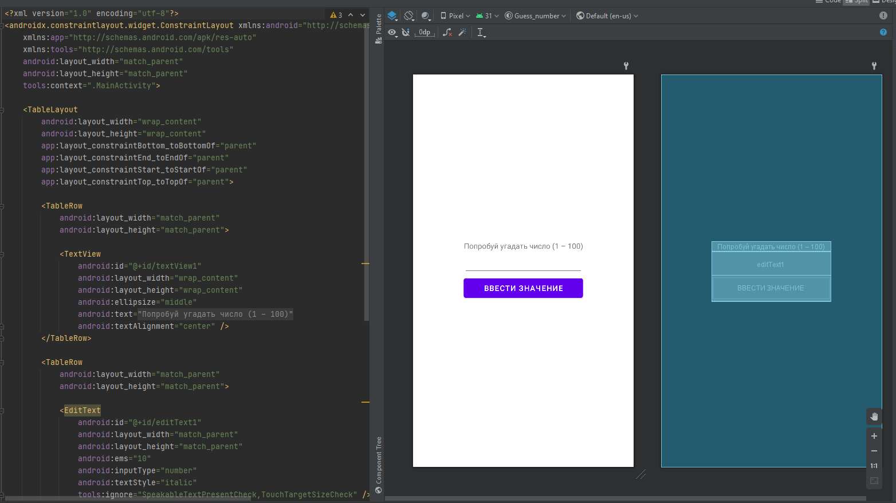
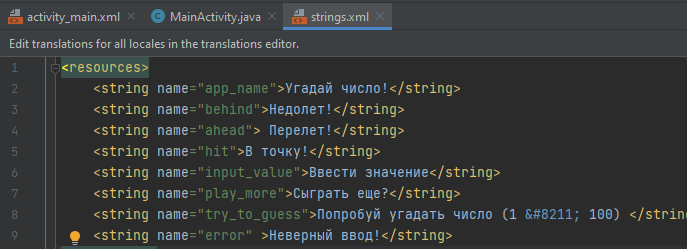
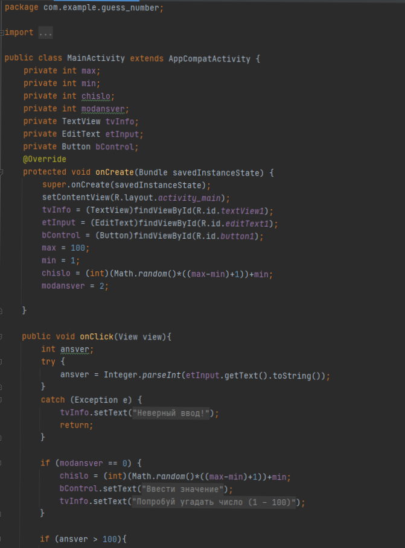

## Guess_number

layout - activity_main.xml

Состоит из:
* TextView
* EditText
* Button

Ресурсы: 

Код программы:

Проверка некорректного ввода происходит через обработчик исключений Try, \
в случае если вводимое значение не является числом \
возбуждается исключения сообщаю пользователю некорректности введённых данных

Оператор Switch обрабатывает оставшиеся события

