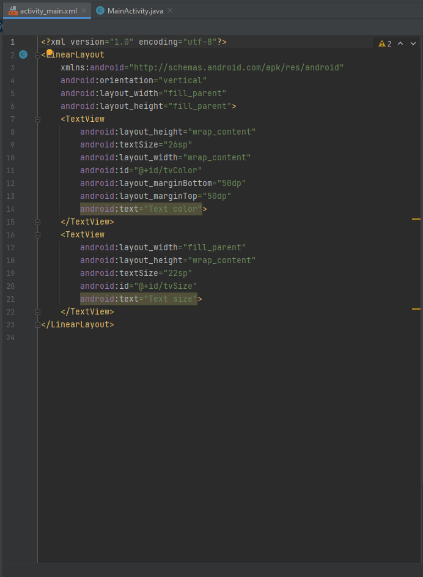
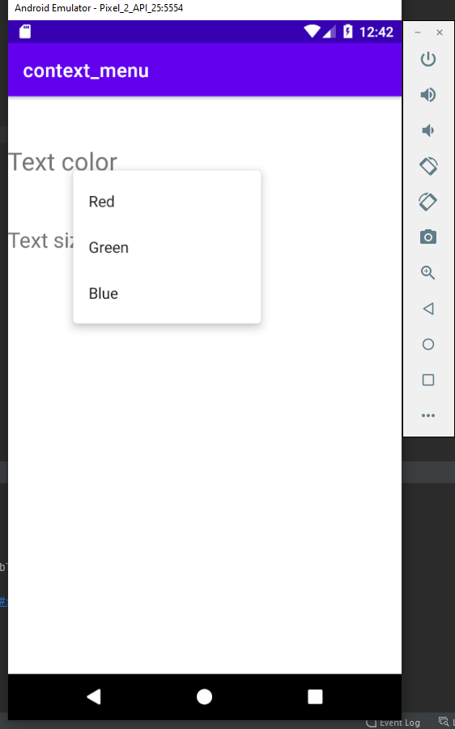

# Сontext_menu

layout - activity_main.xml

Код программы:

Для создание контекстного меню необходимо сначала указать обект, при 
долгом нажатии на который меню появится   
для этого служит функция registerForContextMenu   
После этого можно указать метод вызываемый при создании нового контекстного меню,
в данном приложении контекстное меню создается в соответствии с ID вызвавшего это меню объекта 

