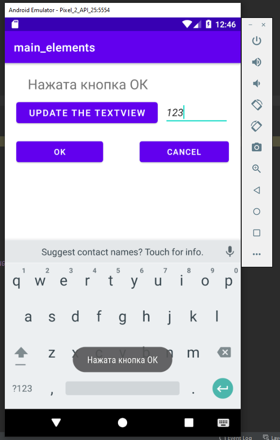

## Main_elements

layout - activity_main.xml

Ресурсы:  

Код программы:

 

При нажатии кнопки текст вызывается функция onClick класса MainActivity считывается
содержимое объекта textedit и обновляется textview   
в соответствии с полученными данными.  
Нажатие кнопки OK и Cancel вызывает функцию onCLick объекта oclBtn, созданного в классе MainActivity,
в зависимости от переданного id кнопки и выполняются те или иные инструкции

### Контрольнве вопросы:

1. TextView, Button, EditText 
2. Через xml файл или при помощи самого кода активности
3. Для удобства написания кода, а также простоты внесения изменений
4. Папка res/values/string.xml
5. Программирование в котором взаимодействие с программой происходит через обработку событий 
6. onCLick, onItemClick onClick обекта oclBtn
