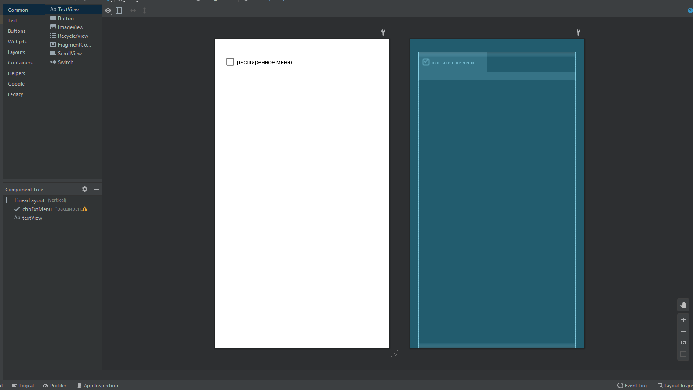
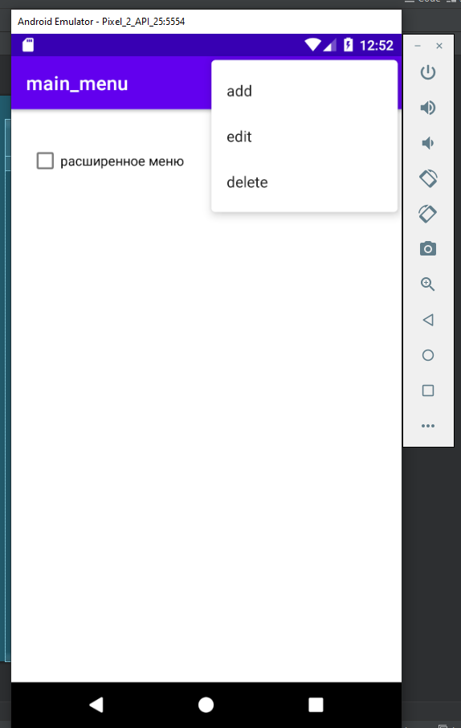
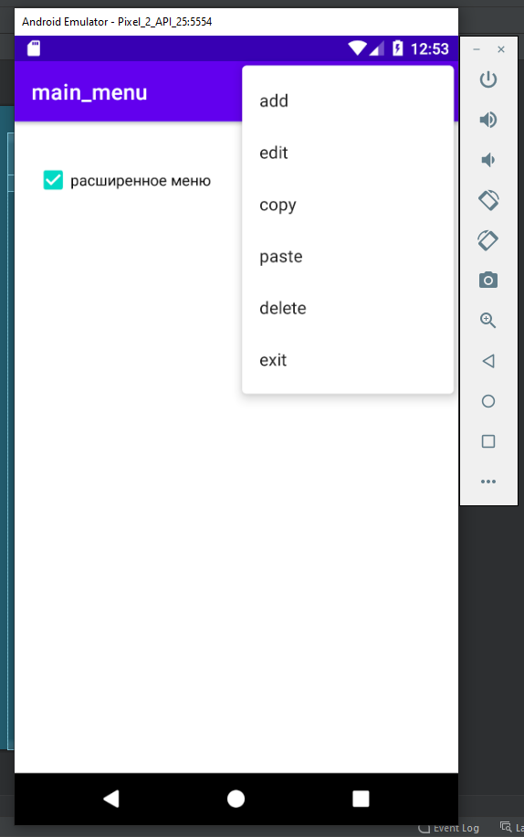

## Main_menu

layout - activity_main.xml, mymenu.xml

Код программы:

В окне приложения расположена радиокнопка и текст.
В случае нажатия на меню в правом верхнем углу экрана происходит вызов функции onCreateOptionsMenu которая в свою очередь вызывает функцию onPrepareOptionsMenu, отвечающую за задание видимой группы.  
В случае нажатия на один из пунктов меню происходит вызов функции onOptionsItemSelected атрибут item содержит информацию о выбранном пункте меню записываемую в textview

