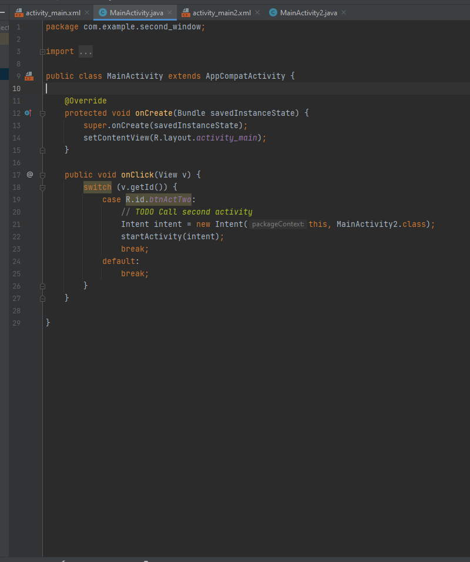
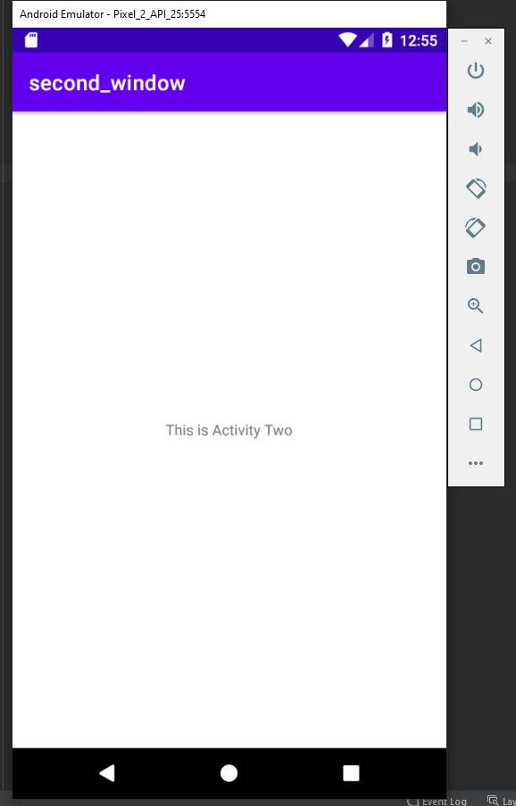

## Second_window

layout - activity_main.xml, activity_main2.xml

Код программы:
* MainActivity
* MainActivity2

При нажатии на кнопку нового окна создается и запускается новая активность
добавляемая в стек активностей и поверх основной 
для этой активности были инициализированы функции вызываемые во время цикла жизни активности отражающие этот процесс в логах

### Контрольные вопросы: 
1. Несколько окон упрощает написание программы, позволяет выделить отдельные активности, а также создание цикла жизни самих активностей как внутри так и отдельно от основной программы
2. Intent(намерение) - это абстрактное описание выполняемой операции, пассивная структура данных, содержащая действия, которое необходимо выполнить.
3. Необходимо создать Intent запроса на вызов новой активности после его запустить ее
4. Task — это набор Activity. Каждый таск содержит свой стек этих Activity. В стандартной ситуации, каждое приложение имеет свой таск и свой стек. При сворачивании приложения, таск уходит в background, но не умирает. Он хранит весь свой стек и при очередном открытии приложения через менеджер или через launcher, существующий таск восстановится и продолжит свою работу.

